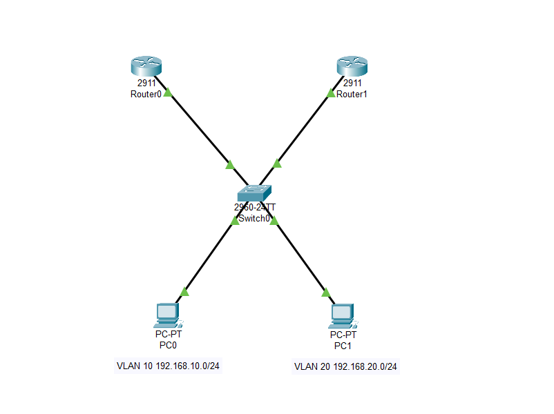
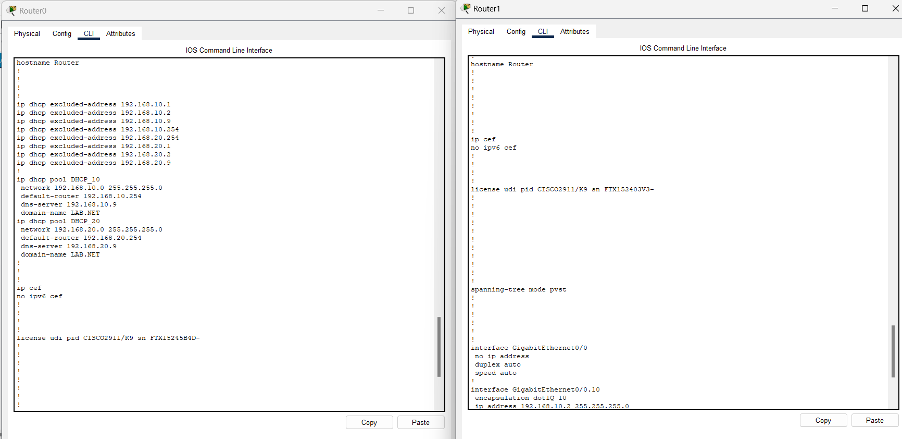
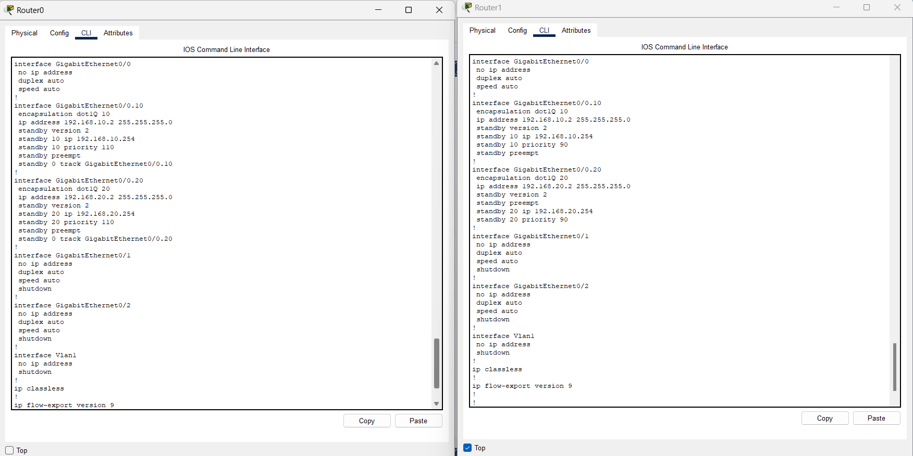
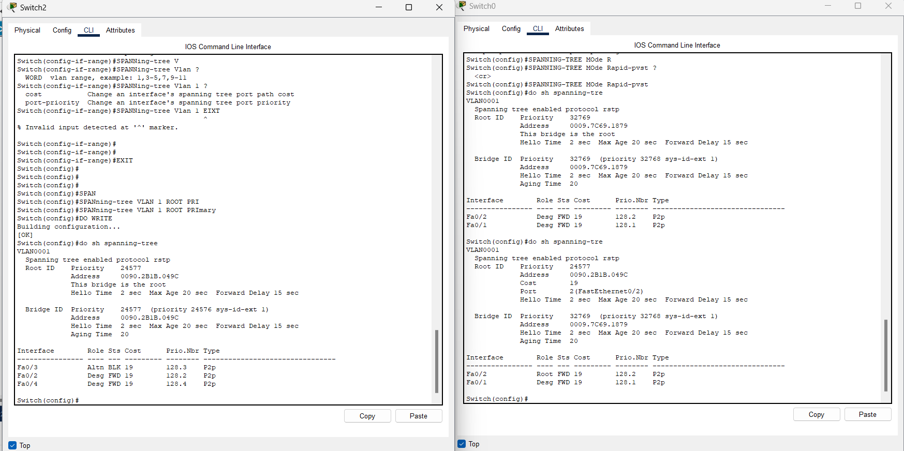
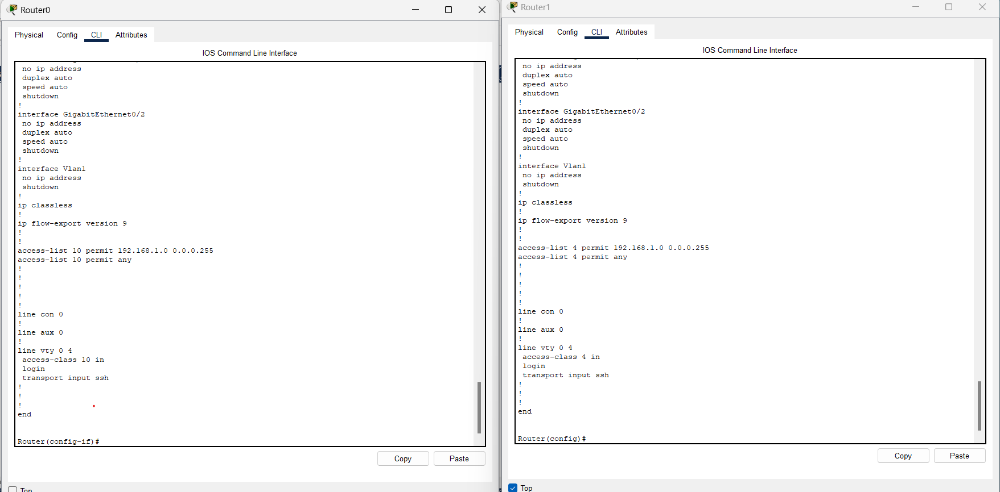
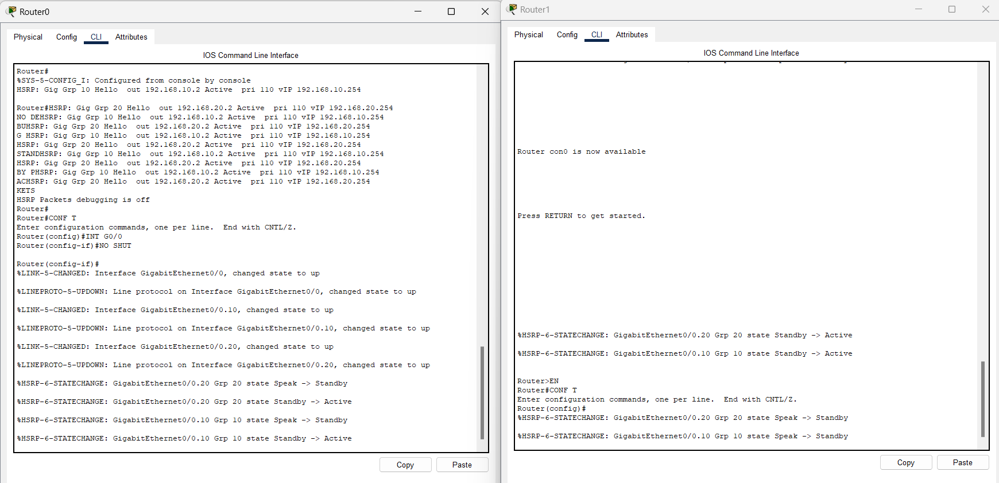
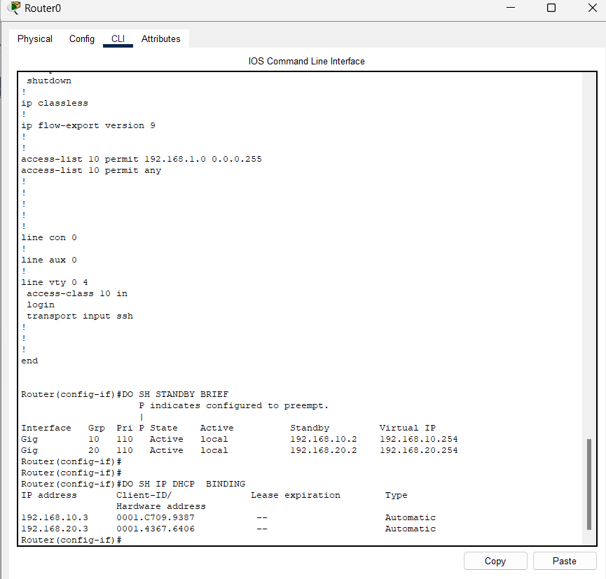
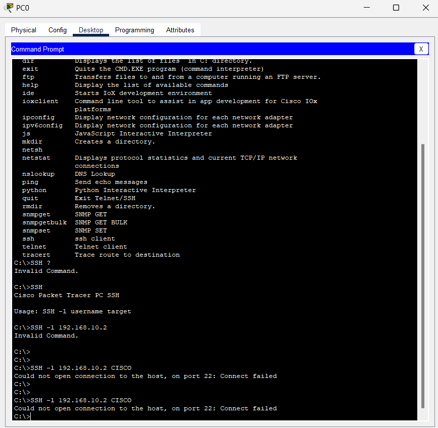

# 🛡️ Haute Disponibilité de Passerelle avec HSRP


> Élimination du point de panne unique sur la passerelle par défaut des utilisateurs : deux routeurs partagent une adresse IP virtuelle via HSRP, avec bascule automatique en cas de panne de lien WAN, et administration distante sécurisée par ACL.

---

## 🎯 En bref

Ce projet met en œuvre un mécanisme de **redondance de passerelle par défaut (First Hop Redundancy Protocol)** pour deux VLANs utilisateurs, avec routage inter-VLAN en *router-on-a-stick* sur deux routeurs. Un routeur actif (R1) et un routeur de secours (R2) partagent une adresse IP virtuelle ; en cas de panne du lien WAN de R1, le tracking d'interface déclenche automatiquement la bascule vers R2, sans interruption perçue côté utilisateur.

**Compétences mises en œuvre :**
- Routage inter-VLAN via sous-interfaces 802.1Q (*router-on-a-stick*)
- Déploiement de **HSRPv2** avec adresse virtuelle, priorités et préemption
- Bascule automatique par **interface tracking** en cas de panne de lien WAN
- Durcissement de l'accès administrateur (**ACL standard + SSH sur VTY**)
- Distribution DHCP centralisée avec passerelle pointant vers l'IP virtuelle
- Configuration **Rapid-PVST+** avec pont racine désigné
- Diagnostic de bascule via les logs d'état HSRP et `show standby`

---

## 📥 Tester le projet

Le fichier de simulation Cisco Packet Tracer (`.pkt`) est disponible dans ce dépôt : **[hsrp-gateway-redundancy.pkt](./hsrp-gateway-redundancy.pkt)**.

Ouvre-le avec [Cisco Packet Tracer](https://www.netacad.com/courses/packet-tracer) (gratuit, inscription NetAcad requise) pour :
- explorer l'ensemble des configurations de R1, R2 et du switch d'accès,
- vérifier l'état HSRP en direct (`show standby`),
- simuler toi-même la panne du lien WAN de R1 (`shutdown` sur l'interface) et observer la bascule vers R2 en temps réel.

---

## 🗺️ Architecture



Deux routeurs (**R1**, **R2**) sont reliés à un switch d'accès via des liens trunk 802.1Q, chacun assurant le routage inter-VLAN pour les VLANs 10 et 20. Les postes clients obtiennent leur adresse IP par DHCP, avec pour passerelle l'adresse virtuelle HSRP commune aux deux routeurs.

## 🔢 Plan d'adressage

| Segment           | Réseau              | R1 (actif) | R2 (secours) | VIP (passerelle) |
|--------------------|---------------------|------------|--------------|-------------------|
| VLAN 10            | 192.168.10.0/24     | .2         | .3           | **.254**          |
| VLAN 20            | 192.168.20.0/24     | .2         | .3           | **.254**          |
| Management (ACL)   | 192.168.1.0/24      | —          | —            | Seul réseau autorisé en SSH |

---

## ⚙️ Réalisations techniques

### Routage inter-VLAN et DHCP centralisé

Sous-interfaces 802.1Q configurées sur R1 et R2, avec un service DHCP porté par R1 pour les deux VLANs utilisateurs — la passerelle distribuée aux clients correspond directement à l'adresse virtuelle HSRP.



### HSRPv2 : adresse virtuelle, priorités et tracking

Chaque sous-interface porte un groupe HSRP dédié (groupe 10 pour le VLAN 10, groupe 20 pour le VLAN 20), avec adresse virtuelle partagée `.254`. R1 est configuré en priorité **110** (actif), R2 en priorité **90** (secours), la préemption étant activée des deux côtés pour un retour automatique à la normale. Le tracking d'interface est en place pour dégrader la priorité de R1 en cas de perte du lien WAN.



### Spanning Tree Rapid-PVST+ sur le switch d'accès

Le protocole Rapid-PVST+ est activé sur le switch reliant les deux routeurs, avec définition explicite du pont racine pour le VLAN 1, garantissant une topologie sans boucle stable.



### Sécurisation de l'administration à distance

Une ACL standard restreint l'accès aux lignes VTY (SSH) au seul sous-réseau de management `192.168.1.0/24`, appliquée sur les deux routeurs.



---

## ✅ Validation

### Bascule automatique HSRP observée en temps réel

Les logs `%HSRP-6-STATECHANGE` capturés sur R0 et R1 montrent les transitions d'état (`Speak → Standby → Active`) confirmant le bon fonctionnement du protocole lors des tests de disponibilité.



### État HSRP et bail DHCP actifs

`show standby brief` confirme que R1 est actif sur les deux groupes avec l'IP virtuelle `.254`, tandis que `show ip dhcp binding` liste les baux distribués aux postes clients.



### Test de sécurité de l'accès administrateur

Depuis un poste client (hors sous-réseau de management), les tentatives de connexion SSH vers la passerelle sont bien rejetées (`Connect failed`), confirmant l'efficacité de l'ACL restreignant l'accès VTY.



---

## 🚀 Pistes d'évolution

- Ajouter une capture de `show standby` **après simulation de panne du lien WAN** pour illustrer explicitement la décrémentation de priorité par le tracking et la bascule complète vers R2.
- Documenter la vérification du trunk 802.1Q côté switch (`show interfaces trunk`) reliant les deux routeurs.
- Étendre le tracking à plusieurs objets (interface + route) pour une détection de panne plus fine.
- Ajouter HSRP sur un troisième VLAN pour valider la scalabilité de la configuration.
- Tester la connexion SSH réussie depuis un poste appartenant au sous-réseau de management autorisé, en complément du test d'échec déjà réalisé.

---

## 📂 Structure du dépôt

```
├── README.md
├── hsrp-gateway-redundancy.pkt          ← fichier de simulation à ouvrir dans Packet Tracer
├── 01_topologie_reseau_packet_tracer.png
├── 2_switches_spanning_tree_rapid_pvst_config.png
├── 03_routers_dhcp_pools_and_dot1q_config.png
├── 04_routers_hsrp_group_and_subinterfaces_config.png
├── 05_routers_hsrp_state_change_logs.png
├── 06_routers_acl_and_vty_ssh_config.png
├── 07_router0_show_standby_and_dhcp_binding.png
└── 08_client_pc0_ssh_connection_tests.png
```

---

## 👤 Auteur

*[ALAYE Odilon Alabi]* 

N'hésite pas à me contacter pour toute question sur ce projet ou pour échanger sur des opportunités en administration réseau / infrastructure.
